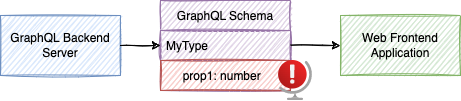
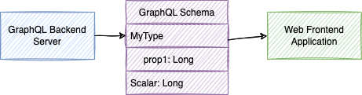
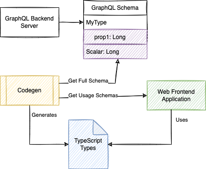
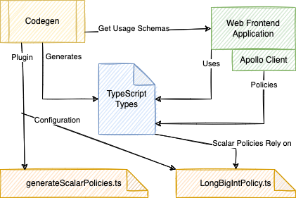

Imagine you must interact with a system that provides 64 bits type, like a `long` in [Java](https://docs.oracle.com/javase/tutorial/java/nutsandbolts/datatypes.html) by GraphQL. The [GraphQL standard does not have a number](https://graphql.org/graphql-js/basic-types/) for 64 bits. 





Relying on number cause issue with a number above [2^53 because of how JavaScript handles number](https://developer.mozilla.org/en-US/docs/Web/JavaScript/Reference/Global_Objects/Number/MAX_SAFE_INTEGER). Hence, above that size, in JavaScript you must create a wrapped type called `BigInt`. While this article focuses on `Long` to `BigInt`, it is the same issue with many other types like `Date`, `Time` or more complex scalar.

# Server Configuration
There is a part that you will need to communicate with the GraphQL server owner. The server cannot send the GraphQL `Int` type, so the server must send the data as a `string`. Sending the value as a Java `Long` would create an accuracy issue. The transmission of the data will be a `number` and causes an issue if the value is above 2^53 bit. The best is to have the server marshaling the value into a `string`. Hence, inside the `string`, the value can be above 2^53. It means the value would be in the format: 

```javascript
data : {
  YourEntityName: {
    myField: "192381290381209381290839012830918209510257182759817287128371298738928"
  }
}
```
To specify to the client that the `string` is actually not a GraphQL `string`, the best is to rely on a [custom scalar](https://graphql.org/learn/schema/). For example, the GraphQL server can create a GraphQL `Long` time. 

```
scalar Long
```



Therefore, the client knows that type is a `Long`, the data is transmitted as a string, and we can tackle the next step with these two pieces of information.

# Client Configuration
On the client-side, there is some work to do. First, I assume you are using TypeScript and [Codegen](https://www.graphql-code-generator.com/) to generate your TypeScript from the GraphQL files. 



I assume you have somehow the whole Graphql Schema and several files in your client repository that have queries, mutations, inputs, and types. Something like:

```yml
schema: "output/introspectionResult.json"
documents: "./src/**/*.graphql"
overwrite: true
generates:
    ./src/autogenerated/allTypes.ts:
        config:
            maybeValue: T | undefined
            preResolveTypes: true
            avoidOptionals: true
        plugins:
            - typescript
            - typescript-operations
```

So, you need to add a couple of details to tell Codegen how to generate the proper type for the custom scalar `Long` and to tell Codegen how to convert the `string` into a BigInt`.

## TypeScript: Converting the Custom Scalar to Your Type

Inside your codegen.yml you can define a `scalars` option. For a `Long` to a `BigInt` you can have:

```
scalars:
    Long: BigInt
```

If you execute the generation, you will see that anywhere in your queries that you are fetching a type of `Long` that the TypeScript generated will have the type `BigInt`. So, the codegen.yml file looks like this:

```yml {10}
schema: "output/introspectionResult.json"
documents: "./src/**/*.graphql"
overwrite: true
generates:
    ./src/autogenerated/allTypes.ts:
        config:
            maybeValue: T | undefined
            preResolveTypes: true
            avoidOptionals: true
            scalar Long
        plugins:
            - typescript
            - typescript-operations

```

However, the work is only for _design_ time so far. At _runtime_, the `typeof` is still a `string`.

## Apollo Client: Converting Value to the Proper Type

The second part is the trickiest. It requires having a custom plugin for Codegen. The plugin's goal is to generate a type policy for the Apollo Client. On every GraphQL request, Apollo will inject the response into the `InMemoryCache`. There is a way with the Apollo Client to have custom logic when data enters the cache. The plugin's goal is to automatically generate these functions for all the fields from your custom scalar. Codegen is the best to know since it analyzes the schema and knows which field is being used in your GraphQL files. Thus, know which field to create the custom policy.

Before diving into the plugin, let's see the `typePolicies` property of Apollo Client (version 3).

```typescript {2}
const cache = new InMemoryCache({
    typePolicies: {
        YourEntityName: {
            fields: {
                myField: longBigIntPolicy
            },
        },
    },
});
```

The example shows that add manually a function called `longBigIntPolicy` for the `YourEntityName.field` that is of type `Long`. While you can do that case by case, a plugin would allow you to handle it for you systematically and have the following code instead.

```typescript {2,3}
const cache = new InMemoryCache({
    typePolicies: {
      ...scalarTypePolicies,
      // You can still define here custom policies
    }
});
```

## Codegen: Plugin to Generate the Type Policies

The codegen.yml needs the last modification to call a plugin to generate the type policies for Apollo to consume. 



First, a configuration for the plugin that maps the `scalarTypePolicies` types. In that example, there is one type: `Long` and it is mapped to `longBigIntPolicy#longBigIntPolicy` which mean  check in the `longBigIntPolicy` file for the function `longBigIntPolicy`. 

Second, there is the plugin that must be a `.js` file. Here it points to `generateScalarPolicies.js`

```yml {11,12,14}
schema: "output/introspectionResult.json"
documents: "./src/**/*.graphql"
overwrite: true
generates:
    ./src/autogenerated/allTypes.ts:
        config:
            maybeValue: T | undefined
            preResolveTypes: true
            avoidOptionals: true
            scalar Long
            scalarTypePolicies:
                Long: "../scalarPolicies/longBigIntPolicy#longBigIntPolicy"
        plugins:
            - ./plugins/output/generateScalarPolicies.js
            - typescript
            - typescript-operations
```

The tricky part is the plugin. We need something that scans all your types against the server's GraphQL schema and identifies where to create an entry for each field. The good news is that there is an [unsupported repository with the plugin](https://github.com/homebound-team/graphql-typescript-scalar-type-policies/blob/main/src/index.ts), and it is written in TypeScript! The bad news is that the NPM is not usable, and the project is not supported. So, we need to copy the code and have a script to run the TypeScript into a JavaScript file before executing the Codegen. You can create a bash script that runs TypeScript and use it before one NPM command you have for your project.

```sh
#Content of ./plugins/generate.sh 
npx tsc plugins/generateScalarPolicies.ts --target es2018 --module commonjs --moduleResolution node --lib esnext --skipLibCheck true --outDir "./plugings/output/"
```

Inside your package.json:
```javascript
"scripts": {
  "gen": "./plugins/generate.sh && graphql-codegen --config codegen.yml"
}
```

The result is that along with your typical generated types, inside `allTypes.ts` (as defined in the `codegen.yml` file), you will have a `const` variable.

```typescript
export const scalarTypePolicies = {
  // ...
}
```
The constant is the one you need to refer to with Apollo.

# Execution
At that point, you can execute your code and see that the type defined as `BigInt` is also the one at runtime. If you are using `typeof` on the field that was defined to be `Long` in the GraphQL schema, it is **not** a `number`, nor a `string` -- it is a `BigInt`. Exactly what we desire.

# Conclusion
Using custom scalar in Apollo Client is very cumbersome. The documentation is scarce, and few solutions are wrong. For example, going with the [Apollo Link](https://github.com/eturino/apollo-link-scalars#usage) route will cause your serialization issue once the data gets into the `InMemoryCache`. Furthermore, that solution requires having the whole schema on the client (browser), which could be impractical for a vast schema. The Codegen solution is elegant because it generates a tailored version of the conversion for your usage and executes once at design time. However, because it requires an unsupported plugin, it raises the question of how well scalar types are supported. A fundamental issue for a system that is based on type. If you look at the problem from the perspective of Apollo, we can see that they are pushed toward a wall: they are in the business of the runtime while the solution must be performed at design time to be efficient. Hence, it must be why [issues have risen for years in their Github](https://github.com/apollographql/apollo-client/issues/8857) without any concrete explanation. On the other side, Codegen has a few Apollo official plugins, but none that perform a type-to-type conversion. Codegen has a [Apollo Client type policies helper](https://www.graphql-code-generator.com/plugins/typescript-apollo-client-helpers), but it is limited to typing the whole policy instead of working on type conversion.

After years of GraphQL standard supporting custom scalar, my final words are that we must still rely on custom code to handle the browser (with Apollo) custom scalar type. That is the reality.